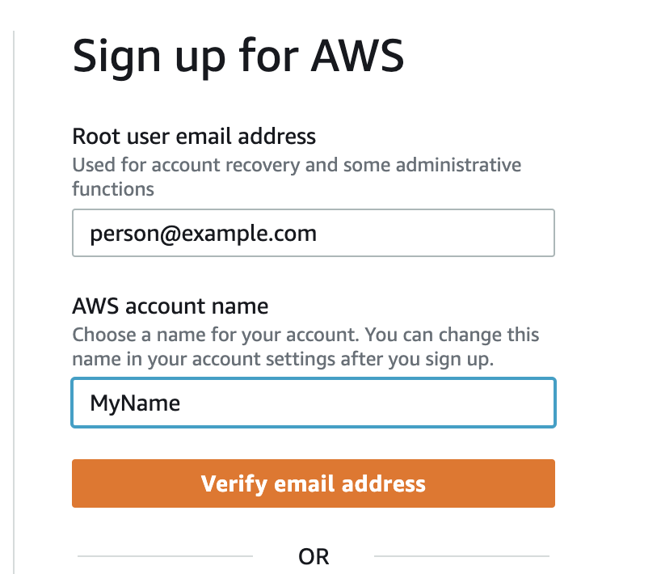

# Creating an AWS account

This week you will be getting an introduction to the cloud. Although the concepts will be as generic as we can make them we will be using AWS for the practical parts of the day. 

To do this please ensure that you sign up for an AWS account using the link below in plenty of time ahead of the actual day. This is because sometimes confirmation emails can take some time to come through. 

[AWS Sign up](https://signin.aws.amazon.com/signin?redirect_uri=https%3A%2F%2Fportal.aws.amazon.com%2Fbilling%2Fsignup%2Fresume&client_id=signup&code_challenge_method=SHA-256&code_challenge=gB8tmx06WBP1rReck54rNwDgCrbY4kJAoOLmh58b298)

Start by creating a Root user from this page. 

You will be emailed a vericication code (this is usually straight away but can sometimes take a few hours to come through). Remember and check junk folders as well.

Create a strong password.

Select Personal plan and fill in your details

Next it will ask for a payment method for billing. (Don't worry, nothing that we will be doing on AWS will incur any charges and in this guide we will be setting up a no spend budget for you.) The services we will be using will be on a free tier or start charging after 12 months by which time you would shut them down. The budget will alert you if anything is going to be charged.

This step is important as you will need to verify payment details before you can access any of the services. 

Next it will ask you to confirm identity via text or call and captcha. 

Select basic support and complete sign up.

## Setting budget limit

After this go to the AWS management console and sign in with root user details.

On the main console page you can search for budgets at the top.

Select AWS budgets.

Create a new budget.

Keep the default settings for use a template and Zero Spend Budget

Enter your email in the Email recipients box

Click Create Budget

And you are good to go! 

